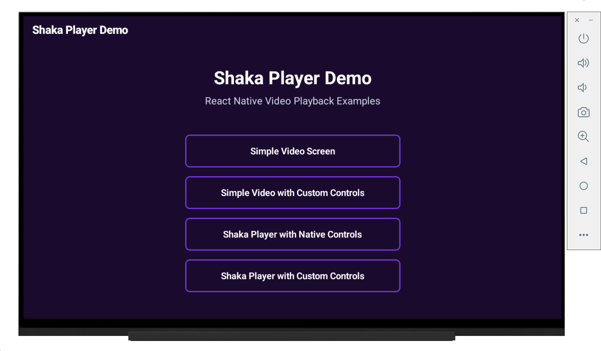
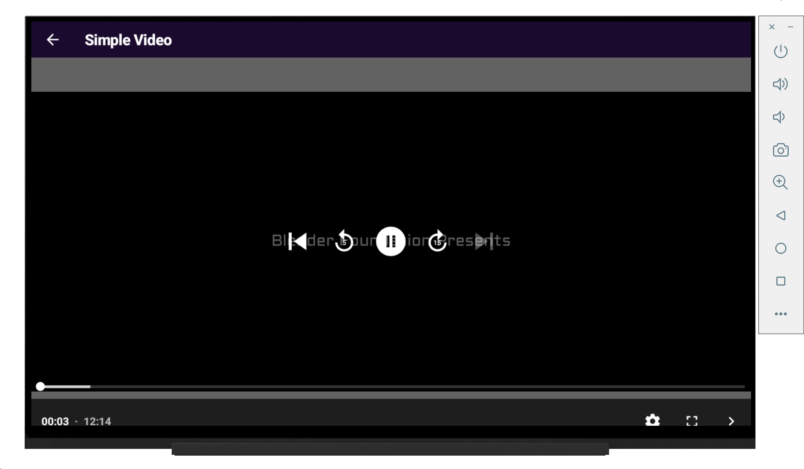
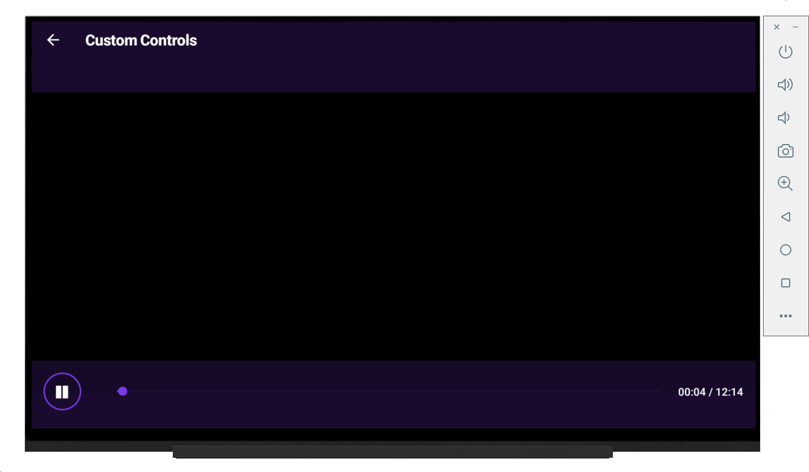
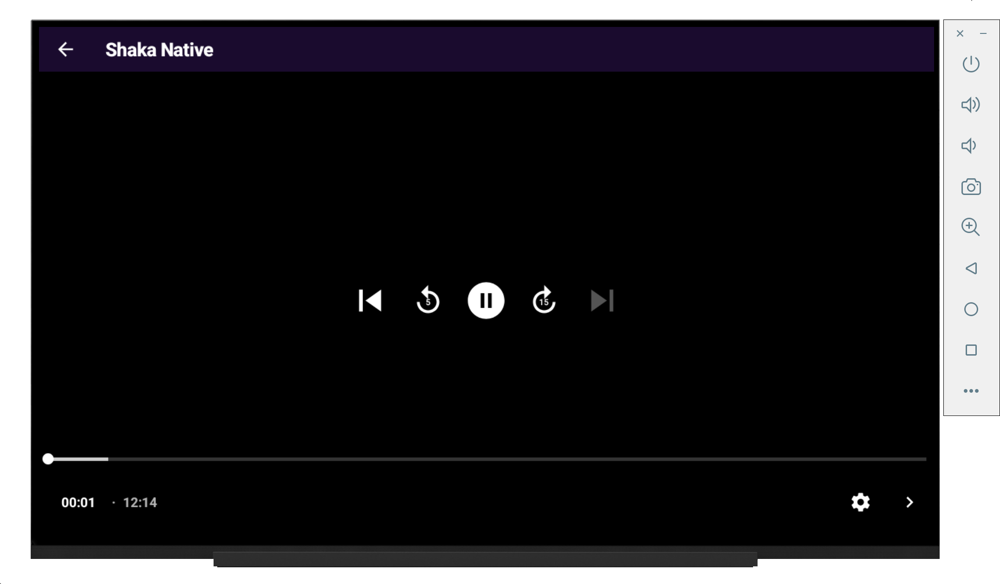
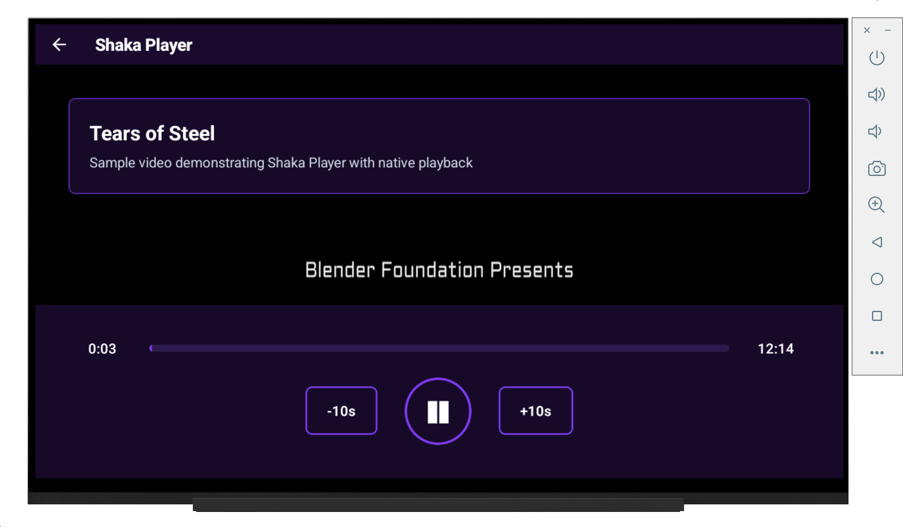

# rn-shaka-player-example

React Native video player demo showcasing Shaka Player integration with custom controls. Features multiple video playback examples with both native and custom UI implementations.

## Screenshots

| Main Screen | Simple Video Player | Custom Slider Controls |
|-------------|--------------------|-----------------------|
|  |  |  |

| Shaka Player Native Controls | Shaka Player Custom UI |
|----------------------------|----------------------|
|  |  |

The app demonstrates various video playback scenarios including basic video playback, custom control implementations, and advanced Shaka Player features for streaming video content.

## Installation

```bash
npm install
```

### Build Shaka Player

Run this script once to build and compile the Shaka Player library:

```bash
./buildShaka.sh
```

This clones the Shaka Player repository and compiles it with HLS, DASH, and offline support features.

### iOS
```bash
cd ios && pod install && cd ..
npx react-native run-ios
```

### Android
```bash
npx react-native run-android
```
